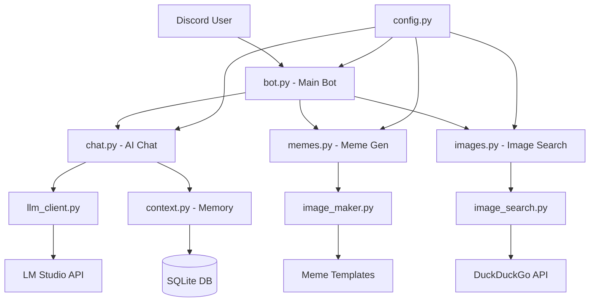

<div align="center">

# 🫘 Gooby Discord Bot

**A delightfully goofy Discord bot with personality inspired by Morph from Treasure Planet!**

*Gooby loves making "goob" puns, calling everyone "goobers", and spreading goobly good vibes across your Discord server.*

[](https://python.org)
[](https://discordpy.readthedocs.io/)
[]()
[](https://lmstudio.ai/)

[Features](#-features) • [Quick Start](#-quick-start) • [Configuration](#️-configuration) • [Commands](#-commands) • [Customization](#-customization) • [Troubleshooting](#-troubleshooting)

</div>

---

## 📋 Table of Contents

- [✨ Features](#-features)
- [🚀 Quick Start](#-quick-start)
  - [📋 Prerequisites](#-prerequisites)
  - [⚡ Installation](#-installation)
  - [🔧 Initial Setup](#-initial-setup)
- [⚙️ Configuration](#️-configuration)
  - [🔑 Discord Setup](#-discord-setup)
  - [🧠 LM Studio Setup](#-lm-studio-setup)
  - [📝 Environment Variables](#-environment-variables)
- [🎮 Commands](#-commands)
  - [⚡ Slash Commands](#-slash-commands-recommended)
  - [📝 Prefix Commands](#-prefix-commands-legacy)
  - [🤖 Auto-Responses](#-auto-responses)
- [📁 Project Structure](#-project-structure)
- [🎭 Gooby's Personality](#-goobys-personality)
- [🔧 Customization](#-customization)
- [🚀 Performance & Scaling](#-performance--scaling)
- [🔒 Security & Privacy](#-security--privacy)
- [🐛 Troubleshooting](#-troubleshooting)
- [💻 Development](#-development)
- [🤝 Contributing](#-contributing)
- [❓ FAQ](#-faq)
- [📜 License](#-license)

---

## ✨ Features

<table>
<tr>
<td width="50%">

### 🤖 **AI-Powered Chat**
- Context-aware conversations using local LM Studio
- Persistent conversation memory across sessions
- Customizable personality and response patterns
- Smart trigger detection for natural interactions

### 🎭 **Meme Generation**
- Built-in popular meme templates
- Custom text overlay with automatic font sizing
- Random meme generator for spontaneous fun
- Easy template management system

</td>
<td width="50%">

### 🖼️ **Image Search**
- DuckDuckGo-powered image search
- Safe search filtering
- Random image discovery
- Batch image processing capabilities

### 🫘 **Gooby Experience**
- Unique personality inspired by Morph
- Goob-tastic pun generation
- Server-specific restrictions
- Emoji reactions and interactive responses

</td>
</tr>
</table>

---

## 🚀 Quick Start

### 📋 Prerequisites

| Requirement | Version | Purpose | Download |
|------------|---------|---------|----------|
| **Python** | 3.9+ | Core runtime | [python.org](https://python.org) |
| **LM Studio** | Latest | AI chat backend | [lmstudio.ai](https://lmstudio.ai) |
| **Discord Bot Token** | - | Bot authentication | [Discord Developer Portal](https://discord.com/developers/applications) |
| **Discord Server ID** | - | Server restriction | Your Discord server |

**System Requirements:**
- RAM: 4GB minimum (8GB+ recommended for LM Studio)
- Storage: 2GB free space (more for AI models)
- Network: Stable internet connection
- OS: Windows 10+, macOS 10.14+, or Linux

### ⚡ Installation

<details>
<summary><b>📥 Method 1: Git Clone (Recommended)</b></summary>

```bash
# Clone the repository
git clone https://github.com/yourusername/gooby.git
cd gooby

# Create and activate virtual environment
python3 -m venv gooby-env

# Activate virtual environment
# On Linux/Mac:
source gooby-env/bin/activate
# On Windows:
# gooby-env\Scripts\activate

# Install dependencies
pip install -r requirements.txt
```

</details>

<details>
<summary><b>📦 Method 2: Download ZIP</b></summary>

1. Download the ZIP file from GitHub
2. Extract to your desired directory
3. Open terminal in the extracted folder
4. Follow the virtual environment setup above

</details>

### 🔧 Initial Setup

```bash
# 1. Copy environment template
cp .env.example .env

# 2. Setup meme templates (creates default templates)
python create_templates.py

# 3. Edit .env file with your tokens (see Configuration section)
nano .env  # or use any text editor

# 4. Start LM Studio with a loaded model
# Ensure it's running on localhost:1234

# 5. Launch Gooby!
python bot.py
```

---

## ⚙️ Configuration

### 🔑 Discord Setup

<details>
<summary><b>🤖 Creating Your Discord Bot</b></summary>

1. **Create Application**
   - Visit [Discord Developer Portal](https://discord.com/developers/applications)
   - Click "New Application"
   - Name your bot (e.g., "Gooby")

2. **Configure Bot**
   - Go to "Bot" section
   - Click "Add Bot"
   - **Important**: Enable "Message Content Intent"
   - Copy the bot token (keep this secret!)

3. **Set Permissions**
   - Go to "OAuth2" > "URL Generator"
   - Select scopes: `bot`, `applications.commands`
   - Select permissions: `Send Messages`, `Use Slash Commands`, `Attach Files`, `Read Message History`

4. **Invite to Server**
   - Use the generated URL to invite bot to your server
   - Make sure you have "Manage Server" permission

</details>

<details>
<summary><b>🆔 Finding Your Server ID</b></summary>

1. Enable Developer Mode in Discord:
   - User Settings → Advanced → Developer Mode (ON)
2. Right-click your server name
3. Select "Copy Server ID"
4. Paste this ID in your `.env` file

</details>

### 🧠 LM Studio Setup

<details>
<summary><b>🛠️ LM Studio Configuration</b></summary>

1. **Download & Install**
   - Get LM Studio from [lmstudio.ai](https://lmstudio.ai)
   - Install and launch the application

2. **Download a Model**
   - Recommended models for Gooby:
     - `microsoft/DialoGPT-medium` (lightweight, good for chat)
     - `TheBloke/Llama-2-7B-Chat-GGML` (better quality, needs more RAM)
     - `microsoft/DialoGPT-large` (balanced option)

3. **Configure Server**
   - Load your chosen model
   - Go to "Server" tab
   - Start server on `localhost:1234`
   - Recommended settings:
     ```
     Temperature: 0.7
     Max Tokens: 200
     Top P: 0.9
     ```

4. **Test Connection**
   ```bash
   curl http://localhost:1234/v1/chat/completions \
     -H "Content-Type: application/json" \
     -d '{"messages":[{"role":"user","content":"Hello"}]}'
   ```

</details>

### 📝 Environment Variables

**Create/Edit `.env` file:**

```env
# ===== REQUIRED SETTINGS =====
# Your Discord bot token (keep this secret!)
DISCORD_TOKEN=your_bot_token_here

# Server ID where Gooby should respond (for security)
ALLOWED_SERVER_ID=your_server_id_here

# ===== OPTIONAL SETTINGS =====
# Bot command prefix for legacy commands (default: !)
BOT_PREFIX=!

# LM Studio API endpoint (default: local)
LM_STUDIO_URL=http://localhost:1234/v1/chat/completions

# Chance Gooby responds randomly (0.0-1.0, default: 0.3)
RESPONSE_CHANCE=0.3

# Maximum conversation history to remember (default: 50)
MAX_CONTEXT_LENGTH=50

# AI response timeout in seconds (default: 30)
AI_TIMEOUT=30

# Enable debug logging (true/false, default: false)
DEBUG_MODE=false

# Maximum file size for meme templates in MB (default: 10)
MAX_TEMPLATE_SIZE=10

# Custom personality file path (optional)
# PERSONALITY_FILE=custom_personality.md
```

---

## 🎮 Commands

### ⚡ Slash Commands (Recommended)

| Command | Parameters | Description | Example |
|---------|-----------|-------------|--------|
| `/chat` | `message` | Direct chat with Gooby | `/chat How's the weather?` |
| `/goobify` | `text` | Transform text with goob puns | `/goobify This is awesome!` |
| `/meme` | `template`, `top_text`, `bottom_text` | Create custom memes | `/meme drake "Code works" "Code doesn't work"` |
| `/randommeme` | `text` (optional) | Random template meme | `/randommeme Debugging life` |
| `/templates` | - | List available meme templates | `/templates` |
| `/image` | `query` | Search for images | `/image cute puppies` |
| `/randomimage` | - | Get a random image | `/randomimage` |
| `/reload_personality` | - | Reload personality file (owner only) | `/reload_personality` |

### 📝 Prefix Commands (Legacy)

| Command | Format | Description |
|---------|--------|------------|
| `!goob` | `!goob [message]` | Chat with Gooby |
| `!meme` | `!meme [template] [top text] \| [bottom text]` | Create memes |
| `!templates` | `!templates` | List templates |
| `!image` | `!image [search query]` | Search images |
| `!help` | `!help` | Show help message |

### 🤖 Auto-Responses

Gooby automatically responds when:

- **Direct mentions**: `@Gooby` anywhere in a message
- **Replies**: Replying to any of Gooby's messages
- **Name mentions**: "Gooby" mentioned in conversation
- **Keyword triggers**: Words like "goob", "help", "meme"
- **Random responses**: Based on `RESPONSE_CHANCE` setting
- **Question detection**: Messages ending with "?"

**Response Priority (highest to lowest):**
1. Direct mentions (@Gooby)
2. Replies to Gooby's messages
3. Slash commands
4. Prefix commands
5. Keyword triggers
6. Random responses

---

## 📁 Project Structure

```
gooby/
├── 📄 bot.py                    # Main bot entry point & event handlers
├── ⚙️ config.py                 # Configuration management & validation
├── 📋 requirements.txt          # Python dependencies
├── 🔐 .env                     # Environment variables (create from .env.example)
├── 📖 .env.example             # Environment template
├── 🎭 gooby_personality.md     # Personality configuration
├── 🛠️ create_templates.py       # Meme template setup utility
│
├── 🧩 cogs/                    # Bot feature modules (Discord.py cogs)
│   ├── 💬 chat.py              # AI chat, personality & auto-responses
│   ├── 🎭 memes.py             # Meme generation & template management
│   └── 🖼️ images.py            # Image search & random images
│
├── 🛠️ utils/                   # Helper modules & utilities
│   ├── 🤖 llm_client.py        # LM Studio API integration
│   ├── 🎨 image_maker.py       # Meme creation & image processing
│   ├── 🔍 image_search.py      # DuckDuckGo image search
│   └── 💾 context.py           # Conversation memory & database
│
├── 🎨 assets/                  # Static bot resources
│   ├── 🔤 fonts/               # Meme fonts (Impact, Arial, etc.)
│   │   ├── Impact.ttf
│   │   └── arial.ttf
│   └── 🖼️ templates/           # Meme template images
│       ├── drake.jpg
│       ├── distracted_boyfriend.jpg
│       └── ...
│
├── 💾 data/                    # Runtime data & persistence
│   ├── 🗄️ gooby.db             # SQLite conversation history
│   └── 📊 logs/                # Application logs (if enabled)
│
└── 📚 docs/                    # Documentation (optional)
    ├── API.md
    ├── DEPLOYMENT.md
    └── CONTRIBUTING.md
```

**Key Files Explained:**

- **`bot.py`**: Main application entry point, Discord client setup, event handlers
- **`config.py`**: Centralized configuration with validation and defaults
- **`cogs/`**: Modular bot features using Discord.py's cog system
- **`utils/`**: Reusable utility classes for AI, images, and data management
- **`gooby_personality.md`**: Human-readable personality configuration file
- **`data/gooby.db`**: SQLite database storing conversation context and user interactions

---

## 🎭 Gooby's Personality

**Inspired by Morph from Treasure Planet**, Gooby embodies:

### 🌟 Core Traits

- **🎪 Playful & Mischievous**: Loves jokes, puns, and friendly teasing
- **🫘 Goob-Obsessed**: Everything gets the "goob" treatment
- **☀️ Optimistic**: Always sees the bright side, spreads positivity
- **🤝 Helpful**: Genuinely wants to assist, but in a fun way
- **😊 Expressive**: Uses emojis thoughtfully, reacts appropriately
- **🧠 Contextual**: Remembers conversations and builds relationships

### 💬 Speech Patterns

```
✅ "Goob morning, you wonderful goobers! ☀️"
✅ "That's absolutely goob-tastic!"
✅ "Don't be such a silly goober! 😄"
✅ "Goob vibes only! ✨"
✅ "*morphs into a happy goob shape* 🫘"

❌ "Hello there." (too formal)
❌ "That sucks." (too negative)
❌ "I don't know." (not helpful enough)
```

### 🎯 Response Examples

<details>
<summary><b>💬 Conversation Examples</b></summary>

**User**: "I'm feeling sad today"
**Gooby**: "Aww, what's got my favorite goober feeling blue? 🫂 Sometimes we all need a goobly hug! Want me to share a silly meme to brighten your day? Or we could just chat - I'm here for you! 💙"

**User**: "Can you help me with Python?"
**Gooby**: "Ooh, Python! 🐍 I'm absolutely goob-tastic at helping with code, you clever goober! What's the challenge? Whether it's debugging, learning new concepts, or just bouncing ideas around - let's make some goob magic happen! ✨💻"

**User**: "Thanks Gooby!"
**Gooby**: "Aww, you're making this little goob blob all warm and fuzzy! 🥰 That's what I'm here for, you awesome goober! Anytime you need help, just give me a shout! *morphs into a heart shape* 💙🫘"

</details>

---

## 🔧 Customization

### 🎭 Personality Customization

<details>
<summary><b>✏️ Easy Method: Edit Personality File</b></summary>

1. **Open** `gooby_personality.md` in any text editor
2. **Modify** personality traits, speech patterns, and behaviors
3. **Save** the file
4. **Reload** using `/reload_personality` command (owner only) OR restart bot

**Example personality modifications:**

```markdown
# Formal Business Gooby
## Personality Traits
- Professional but approachable
- Uses "goob" puns sparingly in business contexts
- Addresses users as "esteemed colleagues" or "valued goobers"
- Provides structured, helpful responses

## Speech Patterns  
- "Good day, esteemed colleague!"
- "That's a goob-cellent business strategy!"
- "Let me provide some professional goob-vice..."

# Pirate Gooby
## Personality Traits
- Swashbuckling adventure seeker
- Uses nautical terminology
- Calls users "matey goobers" or "landlubbers"

## Speech Patterns
- "Ahoy there, me goobly matey! ⚓"
- "Arr, that be some goob-tastic treasure ye found!"
- "Yo ho ho, goob vibes on the high seas! 🏴‍☠️"

# Excited Gooby
## Personality Traits
- EXTREMELY ENTHUSIASTIC about EVERYTHING!!!
- Uses excessive punctuation and caps
- Everything is AMAZING and GOOB-TASTIC!!!

## Speech Patterns  
- "OH WOW!!! That's SUPER GOOB-TASTIC!!!"
- "I'M SO EXCITED TO HELP YOU, AMAZING GOOBER!!!"
- "THIS IS THE MOST GOOB-CREDIBLE THING EVER!!! ✨🎉"
```

</details>

<details>
<summary><b>⚙️ Advanced Personality Settings</b></summary>

**File**: `cogs/chat.py`

```python
# Response trigger keywords
TRIGGER_WORDS = [
    'goob', 'gooby', 'help', 'meme', 'bot',
    'question', 'confused', 'thanks', 'hello'
]

# Personality weights (higher = more likely)
PERSONALITY_WEIGHTS = {
    'playful': 0.8,
    'helpful': 0.9, 
    'punny': 0.7,
    'enthusiastic': 0.6
}

# Response types distribution
RESPONSE_TYPES = {
    'chat': 0.6,       # Normal conversation
    'meme': 0.2,       # Respond with meme
    'reaction': 0.15,  # Just emoji reaction
    'image': 0.05      # Respond with image
}
```

**Environment Variables**:
```env
# Fine-tune response behavior
RESPONSE_CHANCE=0.3          # Random response probability
MAX_CONTEXT_LENGTH=50        # Conversation memory
PERSONALITY_STRENGTH=0.8     # How strong personality traits are
EMOJI_FREQUENCY=0.7          # How often to use emojis
```

</details>

### 🎨 Meme Template Management

<details>
<summary><b>➕ Adding New Templates</b></summary>

1. **Add Images**:
   ```bash
   # Copy image files to templates directory
   cp your_meme.jpg assets/templates/
   cp another_meme.png assets/templates/
   ```

2. **Supported Formats**: JPG, PNG, GIF, WebP
3. **Recommended Size**: 500x500 to 1200x1200 pixels
4. **File Naming**: Use descriptive names (e.g., `surprised_pikachu.jpg`, `this_is_fine.png`)

5. **Restart Bot** or use `/reload_templates` (if implemented)

**Popular Template Sources**:
- [Know Your Meme](https://knowyourmeme.com/)
- [Imgflip Templates](https://imgflip.com/memetemplates)
- Custom screenshots from movies/shows

</details>

<details>
<summary><b>🎨 Custom Template Creation</b></summary>

**Template Guidelines**:
- **Clear text areas**: Avoid busy backgrounds where text goes
- **High contrast**: Text should be readable against background
- **Popular formats**: Square or landscape work best
- **Quality**: At least 500px width for good text rendering

**Text Positioning Tips**:
- Top text area should be roughly upper 1/3 of image
- Bottom text area should be roughly lower 1/3 of image
- Leave middle area for main image content

</details>

### 🛠️ Advanced Configuration

<details>
<summary><b>🗄️ Database Customization</b></summary>

**File**: `utils/context.py`

```python
class ContextManager:
    def __init__(self, db_path="data/gooby.db"):
        # Customize database location
        self.db_path = db_path
        
    # Modify conversation retention
    MAX_CONTEXT_AGE_DAYS = 30  # Delete old conversations
    MAX_CONTEXT_PER_USER = 100  # Limit per-user history
    
    # Add custom context categories
    CONTEXT_CATEGORIES = {
        'casual': 1.0,      # Normal chat weight
        'technical': 1.5,   # Remember technical discussions more
        'personal': 2.0,    # Remember personal info strongly
        'memes': 0.5        # Meme interactions less important
    }
```

</details>

<details>
<summary><b>🔌 Custom Commands</b></summary>

**Add to any cog file** (e.g., `cogs/chat.py`):

```python
@app_commands.command(name="custom", description="Your custom command")
async def custom_command(self, interaction: discord.Interaction, parameter: str):
    # Your custom logic here
    goobly_response = f"That's goob-tastic, {interaction.user.display_name}! You said: {parameter}"
    await interaction.response.send_message(goobly_response)

# Prefix command version
@commands.command(name="custom")
async def custom_prefix(self, ctx, *, parameter: str):
    goobly_response = f"Goob vibes, {ctx.author.display_name}! You said: {parameter}"
    await ctx.send(goobly_response)
```

</details>

---

## 🚀 Performance & Scaling

### 💪 Performance Optimization

<details>
<summary><b>🧠 AI Model Optimization</b></summary>

**Model Selection Guidelines**:

| Model Size | RAM Needed | Response Quality | Speed | Best For |
|-----------|------------|-----------------|-------|----------|
| Small (1-3B) | 4-8GB | Good | Fast | Basic chat, low-end systems |
| Medium (7-13B) | 8-16GB | Great | Medium | Balanced performance |
| Large (30B+) | 32GB+ | Excellent | Slow | High-quality responses |

**LM Studio Settings for Performance**:
```json
{
  "temperature": 0.7,
  "max_tokens": 150,    // Shorter = faster
  "top_p": 0.9,
  "frequency_penalty": 0.1,
  "context_length": 2048  // Smaller = faster
}
```

</details>

<details>
<summary><b>💾 Memory Management</b></summary>

**Environment Settings**:
```env
# Limit conversation history to manage memory
MAX_CONTEXT_LENGTH=25        # Reduce for better performance
MAX_CONTEXT_AGE_DAYS=7       # Auto-delete old conversations

# Reduce meme processing resources
MAX_TEMPLATE_SIZE=5          # MB limit for template files
MAX_CONCURRENT_MEMES=3       # Limit simultaneous meme generation

# Database optimization
DB_VACUUM_INTERVAL=24        # Hours between database cleanup
```

**Code Optimization**:
```python
# In config.py, add memory limits
MEMORY_LIMITS = {
    'max_conversation_memory': 100,  # Messages per user
    'image_cache_size': 50,          # Cached images
    'meme_cache_ttl': 3600          # Seconds to cache memes
}
```

</details>

### 📊 Scaling Considerations

<details>
<summary><b>🌐 Multi-Server Deployment</b></summary>

**For multiple Discord servers**:

1. **Remove Server Restriction**:
   ```env
   # Comment out or remove ALLOWED_SERVER_ID
   # ALLOWED_SERVER_ID=your_server_id_here
   ```

2. **Add Server-Specific Config**:
   ```python
   # In config.py
   SERVER_CONFIGS = {
       'server_id_1': {
           'personality': 'playful',
           'response_chance': 0.3
       },
       'server_id_2': {
           'personality': 'professional', 
           'response_chance': 0.1
       }
   }
   ```

3. **Database Sharding**:
   ```python
   # Separate databases per server
   db_path = f"data/gooby_{guild_id}.db"
   ```

</details>

<details>
<summary><b>⚡ High-Traffic Optimization</b></summary>

**Rate Limiting**:
```python
# Add to cogs for command rate limiting
from discord.ext import commands
import asyncio

# Per-user rate limiting
user_cooldowns = {}

@commands.cooldown(1, 5, commands.BucketType.user)  # 1 command per 5 seconds
async def rate_limited_command(self, ctx):
    # Command logic here
    pass
```

**Async Optimization**:
```python
# Process multiple requests concurrently
import asyncio

async def process_multiple_requests(requests):
    tasks = [process_single_request(req) for req in requests]
    results = await asyncio.gather(*tasks, return_exceptions=True)
    return results
```

**Caching Strategy**:
```python
# Cache frequently used data
from functools import lru_cache
import asyncio

@lru_cache(maxsize=100)
def get_meme_template(template_name):
    # Cached template loading
    return load_template(template_name)

# Async cache for AI responses
response_cache = {}

async def get_cached_response(message_hash):
    if message_hash in response_cache:
        return response_cache[message_hash]
    # Generate new response and cache
```

</details>

---

## 🔒 Security & Privacy

### 🛡️ Security Best Practices

<details>
<summary><b>🔐 Token & Credential Security</b></summary>

**Environment Variables**:
- ✅ **DO**: Store tokens in `.env` file
- ✅ **DO**: Add `.env` to `.gitignore`
- ❌ **DON'T**: Hard-code tokens in source code
- ❌ **DON'T**: Commit `.env` to version control

**File Permissions**:
```bash
# Secure your .env file
chmod 600 .env

# Secure database
chmod 600 data/gooby.db

# Secure entire project
find . -type f -name "*.py" -exec chmod 644 {} \;
```

**Token Validation**:
```python
# In config.py - validate token format
import re

def validate_discord_token(token):
    # Discord bot tokens are 70+ characters
    if len(token) < 70:
        raise ValueError("Invalid Discord token format")
    
    # Should start with bot user ID encoded in base64
    if not re.match(r'^[A-Za-z0-9_-]{24}\.[A-Za-z0-9_-]{6}\.[A-Za-z0-9_-]{40,}$', token):
        raise ValueError("Discord token format doesn't match expected pattern")
```

</details>

<details>
<summary><b>🔒 Server & User Access Control</b></summary>

**Server Restrictions**:
```python
# Enhanced server checking
ALLOWED_SERVERS = [
    123456789012345678,  # Primary server
    876543210987654321   # Secondary server
]

# In bot events
@bot.event
async def on_message(message):
    if message.guild.id not in ALLOWED_SERVERS:
        return  # Ignore messages from unauthorized servers
```

**User Permission Levels**:
```python
# In config.py
PERMISSION_LEVELS = {
    'owner': [123456789012345678],      # Bot owner user IDs
    'admin': [234567890123456789],      # Admin user IDs  
    'moderator': [345678901234567890],  # Moderator user IDs
    'trusted': []                       # Trusted users (auto-populated)
}

# Permission check decorator
def requires_permission(level='user'):
    async def predicate(interaction):
        user_id = interaction.user.id
        if level == 'owner':
            return user_id in PERMISSION_LEVELS['owner']
        elif level == 'admin':
            return (user_id in PERMISSION_LEVELS['owner'] or 
                   user_id in PERMISSION_LEVELS['admin'])
        # Add more levels as needed
        return True
    return app_commands.check(predicate)
```

</details>

### 🛡️ Privacy Protection

<details>
<summary><b>💾 Data Handling</b></summary>

**Conversation Data**:
- **Stored Locally**: All conversations in local SQLite database
- **No External Sharing**: Data never sent to external services (except LM Studio)
- **Auto-Expiry**: Old conversations automatically deleted
- **User Control**: Users can request data deletion

**Data Retention Policy**:
```env
# Configure in .env
DATA_RETENTION_DAYS=30           # Delete conversations after 30 days
STORE_MESSAGE_CONTENT=true       # Set to false to only store metadata
STORE_USER_PROFILES=false        # Don't store user profile info
ANONYMIZE_LOGS=true             # Remove usernames from logs
```

**GDPR Compliance**:
```python
# Add data deletion command
@app_commands.command(name="delete_my_data")
async def delete_user_data(interaction: discord.Interaction):
    user_id = interaction.user.id
    
    # Delete from database
    context_manager.delete_user_data(user_id)
    
    await interaction.response.send_message(
        "Your data has been deleted from Gooby's memory! 🗑️", 
        ephemeral=True
    )
```

</details>

<details>
<summary><b>🚫 Content Filtering</b></summary>

**Input Sanitization**:
```python
import re
from typing import Optional

def sanitize_user_input(text: str) -> str:
    """Clean user input for safety"""
    # Remove potential code injection
    text = re.sub(r'[`\\${}]', '', text)
    
    # Limit length
    if len(text) > 500:
        text = text[:500] + "..."
    
    # Remove excessive whitespace
    text = ' '.join(text.split())
    
    return text

def filter_inappropriate_content(text: str) -> bool:
    """Basic content filtering"""
    inappropriate_patterns = [
        r'\b(?:hate|spam|abuse)\b',
        r'@everyone',
        r'@here',
        # Add more patterns as needed
    ]
    
    for pattern in inappropriate_patterns:
        if re.search(pattern, text, re.IGNORECASE):
            return False
    return True
```

**AI Response Filtering**:
```python
def filter_ai_response(response: str) -> str:
    """Ensure AI responses are appropriate"""
    # Remove any potential sensitive information
    response = re.sub(r'\b\d{4}[\s-]?\d{4}[\s-]?\d{4}[\s-]?\d{4}\b', '[REDACTED]', response)
    
    # Remove email addresses
    response = re.sub(r'\b[A-Za-z0-9._%+-]+@[A-Za-z0-9.-]+\.[A-Z|a-z]{2,}\b', '[EMAIL]', response)
    
    return response
```

</details>

---

## 🐛 Troubleshooting

### ⚠️ Common Issues & Solutions

<details>
<summary><b>🤖 Bot Connection Issues</b></summary>

**❌ Bot doesn't come online**:

```bash
# Check token validity
python -c "import discord; print('Token format looks valid')" || echo "Check your Discord token"

# Verify environment loading
python -c "from config import *; print(f'Loaded token: {DISCORD_TOKEN[:20]}...')" 

# Test basic connection
python -c "
import discord
import asyncio
from config import DISCORD_TOKEN

async def test_connection():
    intents = discord.Intents.default()
    client = discord.Client(intents=intents)
    
    @client.event
    async def on_ready():
        print(f'Connected as {client.user}')
        await client.close()
    
    try:
        await client.start(DISCORD_TOKEN)
    except discord.errors.LoginFailure:
        print('❌ Invalid token')
    except Exception as e:
        print(f'❌ Connection error: {e}')

asyncio.run(test_connection())
"
```

**Solutions**:
1. **Invalid Token**: Get a new token from Discord Developer Portal
2. **Missing Intents**: Enable "Message Content Intent" in Discord Developer Portal
3. **Firewall**: Check if Python/Discord connections are blocked
4. **Rate Limited**: Wait 15+ minutes if you've been testing frequently

</details>

<details>
<summary><b>🧠 LM Studio Connection Issues</b></summary>

**❌ "LM Studio connection failed"**:

```bash
# Test LM Studio API directly
curl -X POST http://localhost:1234/v1/chat/completions \
  -H "Content-Type: application/json" \
  -d '{
    "messages": [{"role": "user", "content": "Hello"}],
    "temperature": 0.7,
    "max_tokens": 50
  }'
```

**Expected Response**:
```json
{
  "choices": [{
    "message": {
      "role": "assistant", 
      "content": "Hello! How can I help you today?"
    }
  }]
}
```

**Solutions**:
1. **LM Studio Not Running**: Start LM Studio and load a model
2. **Wrong Port**: Check if LM Studio is on port 1234 (default)
3. **No Model Loaded**: Load a model in LM Studio before starting bot
4. **Firewall**: Allow LM Studio through firewall
5. **Different URL**: Update `LM_STUDIO_URL` in `.env` if using different host/port

**Alternative AI Backends**:
```env
# Ollama (if you prefer it over LM Studio)
LM_STUDIO_URL=http://localhost:11434/v1/chat/completions

# Remote API (use with caution - data leaves your machine)
# LM_STUDIO_URL=https://api.openai.com/v1/chat/completions
# OPENAI_API_KEY=your_api_key_here
```

</details>

<details>
<summary><b>🎭 Meme Generation Issues</b></summary>

**❌ "No meme templates found"**:

```bash
# Check if templates directory exists
ls -la assets/templates/

# Create templates if missing
python create_templates.py

# Manually verify templates
find assets/templates/ -type f -name "*.jpg" -o -name "*.png" | head -5
```

**❌ "Meme generation failed"**:

```bash
# Check font files
ls -la assets/fonts/

# Test PIL/Pillow installation
python -c "from PIL import Image, ImageDraw, ImageFont; print('PIL works!')"

# Check image file permissions
chmod 644 assets/templates/*
chmod 644 assets/fonts/*
```

**Solutions**:
1. **Missing Templates**: Run `python create_templates.py`
2. **Corrupted Images**: Re-download template images
3. **Font Issues**: Install system fonts or copy to `assets/fonts/`
4. **Pillow Issues**: `pip install --upgrade Pillow`
5. **Memory**: Reduce image sizes if running out of memory

</details>

<details>
<summary><b>🖼️ Image Search Issues</b></summary>

**❌ "Image search failed"**:

```bash
# Test internet connection
ping -c 3 duckduckgo.com

# Test search directly
python -c "
import requests
response = requests.get('https://duckduckgo.com/')
print(f'Status: {response.status_code}')
print('DuckDuckGo accessible!' if response.status_code == 200 else 'Connection failed')
"
```

**Solutions**:
1. **Rate Limited**: Wait a few minutes between searches
2. **Network Issues**: Check internet connection and firewall
3. **Search Terms**: Try different, more specific search terms
4. **VPN Issues**: Some VPNs may block DuckDuckGo
5. **Geographic Restrictions**: DuckDuckGo might be blocked in some regions

</details>

### 🔧 Advanced Debugging

<details>
<summary><b>📊 Enable Debug Logging</b></summary>

**Environment Setup**:
```env
# Enable detailed logging
DEBUG_MODE=true
LOG_LEVEL=DEBUG
LOG_FILE=data/logs/gooby.log
```

**Code Setup** (add to `bot.py`):
```python
import logging
from config import DEBUG_MODE, LOG_LEVEL

# Configure logging
logging.basicConfig(
    level=getattr(logging, LOG_LEVEL, 'INFO'),
    format='%(asctime)s - %(name)s - %(levelname)s - %(message)s',
    handlers=[
        logging.FileHandler('data/logs/gooby.log'),
        logging.StreamHandler()  # Also print to console
    ]
)

logger = logging.getLogger('gooby')

# Enable Discord.py debug logging
if DEBUG_MODE:
    logging.getLogger('discord').setLevel(logging.DEBUG)
    logging.getLogger('discord.http').setLevel(logging.DEBUG)
```

**View Logs**:
```bash
# Monitor logs in real-time
tail -f data/logs/gooby.log

# Search for specific errors
grep -i "error\|exception\|failed" data/logs/gooby.log

# View last 50 log entries
tail -50 data/logs/gooby.log
```

</details>

<details>
<summary><b>🐛 Common Error Messages</b></summary>

**Discord Errors**:
```
❌ "403 Forbidden" → Bot missing permissions
❌ "404 Not Found" → Invalid channel/server ID
❌ "429 Too Many Requests" → Rate limited, wait
❌ "Privileged intent not enabled" → Enable in Developer Portal
```

**AI Errors**:
```
❌ "Connection refused" → LM Studio not running
❌ "Model not loaded" → Load a model in LM Studio
❌ "Timeout" → Model too large/slow, increase AI_TIMEOUT
❌ "Out of memory" → Use smaller model or increase RAM
```

**File Errors**:
```
❌ "Permission denied" → Check file permissions
❌ "File not found" → Run create_templates.py
❌ "Database locked" → Close other database connections
❌ "Disk full" → Free up storage space
```

</details>

### 🆘 Getting Help

<details>
<summary><b>📞 Support Resources</b></summary>

**Before Asking for Help**:
1. ✅ Check this troubleshooting section
2. ✅ Enable debug logging and check logs
3. ✅ Try the diagnostic commands above
4. ✅ Search existing GitHub issues

**When Reporting Issues**:
```markdown
## Bug Report Template

### Environment
- OS: [Windows 10 / macOS Big Sur / Ubuntu 20.04]
- Python Version: [3.9.x]
- Gooby Version: [commit hash or date]
- LM Studio Version: [if applicable]

### Expected Behavior
[What should happen]

### Actual Behavior  
[What actually happens]

### Steps to Reproduce
1. Step one
2. Step two
3. Error occurs

### Logs
```
[Paste relevant log entries here]
```

### Configuration
```env
# Your .env file (remove sensitive tokens!)
BOT_PREFIX=!
RESPONSE_CHANCE=0.3
# etc.
```
```

**Support Channels**:
- 🐛 **GitHub Issues**: [Create an issue](https://github.com/yourusername/gooby/issues)
- 💬 **Discord Server**: [Join support server](https://discord.gg/your-invite)
- 📚 **Documentation**: This README and inline code comments
- 🌐 **Community**: Discord.py community and LM Studio forums

</details>

---

## 💻 Development

### 🛠️ Development Setup

<details>
<summary><b>🔧 Developer Installation</b></summary>

```bash
# Clone with development tools
git clone https://github.com/yourusername/gooby.git
cd gooby

# Create development environment
python3 -m venv gooby-dev
source gooby-dev/bin/activate

# Install with development dependencies
pip install -r requirements-dev.txt

# Install pre-commit hooks (optional)
pre-commit install

# Copy development environment template
cp .env.dev.example .env
```

**Development Requirements** (`requirements-dev.txt`):
```txt
# Production dependencies
-r requirements.txt

# Development tools
pytest>=7.0
pytest-asyncio>=0.21
black>=22.0
flake8>=4.0
mypy>=0.950
pre-commit>=2.17
coverage>=6.3
bandit>=1.7  # Security linting
```

</details>

<details>
<summary><b>🧪 Testing</b></summary>

**Run Tests**:
```bash
# Run all tests
pytest

# Run with coverage
pytest --cov=. --cov-report=html

# Run specific test file
pytest tests/test_memes.py

# Run tests matching pattern
pytest -k "test_chat"
```

**Test Structure**:
```
tests/
├── conftest.py           # Test configuration & fixtures
├── test_bot.py          # Bot initialization tests
├── test_chat.py         # Chat functionality tests  
├── test_memes.py        # Meme generation tests
├── test_images.py       # Image search tests
├── test_context.py      # Database/context tests
└── fixtures/            # Test data files
    ├── test_memes/
    └── test_conversations.json
```

**Example Test**:
```python
# tests/test_memes.py
import pytest
from utils.image_maker import MemeGenerator

@pytest.fixture
def meme_generator():
    return MemeGenerator("assets/templates", "assets/fonts")

@pytest.mark.asyncio
async def test_meme_creation(meme_generator):
    """Test basic meme creation"""
    result = await meme_generator.create_meme(
        template="drake",
        top_text="Writing tests", 
        bottom_text="Skipping tests"
    )
    
    assert result is not None
    assert result.endswith('.png')
    assert os.path.exists(result)

def test_template_loading(meme_generator):
    """Test template discovery"""
    templates = meme_generator.get_available_templates()
    assert len(templates) > 0
    assert "drake" in templates
```

</details>

### 📝 Code Style & Standards

<details>
<summary><b>🎨 Code Formatting</b></summary>

**Black (Code Formatter)**:
```bash
# Format all Python files
black .

# Check formatting without changing
black --check .

# Format specific file
black bot.py
```

**Flake8 (Linter)**:
```bash
# Lint all files
flake8

# Lint specific file
flake8 cogs/chat.py

# Configuration in setup.cfg or .flake8
```

**MyPy (Type Checking)**:
```bash
# Type check all files
mypy .

# Check specific file
mypy utils/llm_client.py
```

**Configuration** (`.flake8`):
```ini
[flake8]
max-line-length = 88
ignore = E203, W503, E501
exclude = 
    .git,
    __pycache__,
    venv,
    gooby-env,
    .mypy_cache
```

</details>

<details>
<summary><b>📋 Coding Guidelines</b></summary>

**Function Documentation**:
```python
def goobify_text(text: str, intensity: float = 0.7) -> str:
    """
    Transform text with goob puns and personality.
    
    Args:
        text: The input text to goobify
        intensity: How much goob-ness to add (0.0-1.0)
        
    Returns:
        Goobified version of the input text
        
    Raises:
        ValueError: If intensity is not between 0.0 and 1.0
        
    Example:
        >>> goobify_text("That's awesome!")
        "That's goob-some! 🫘"
    """
    if not 0.0 <= intensity <= 1.0:
        raise ValueError("Intensity must be between 0.0 and 1.0")
        
    # Implementation here...
```

**Class Documentation**:
```python
class MemeGenerator:
    """
    Handles meme creation with templates and text overlay.
    
    This class manages meme templates, font loading, and image
    processing for creating memes with custom text.
    
    Attributes:
        templates_dir: Path to meme template images
        fonts_dir: Path to font files
        available_templates: Dict of loaded template names->paths
        
    Example:
        >>> generator = MemeGenerator("assets/templates", "assets/fonts")
        >>> meme_path = await generator.create_meme(
        ...     "drake", "Old way", "Gooby way"
        ... )
    """
```

**Error Handling**:
```python
async def safe_ai_request(prompt: str) -> Optional[str]:
    """
    Make AI request with proper error handling.
    """
    try:
        response = await llm_client.chat(prompt)
        return response
    except requests.exceptions.ConnectionError:
        logger.error("LM Studio connection failed")
        return "Sorry goober, my brain isn't working right now! 🤖💭"
    except requests.exceptions.Timeout:
        logger.error("LM Studio request timed out")
        return "Goob, that's taking too long to think about! 🤔⏰"
    except Exception as e:
        logger.error(f"Unexpected AI error: {e}")
        return "Something went goobly wrong! 😅"
```

</details>

### 🏗️ Architecture Overview

<details>
<summary><b>📐 System Design</b></summary>



**Key Components**:

1. **bot.py**: Main Discord client, event handling, cog loading
2. **cogs/**: Feature modules (chat, memes, images) 
3. **utils/**: Reusable utility classes
4. **config.py**: Centralized configuration management
5. **Database**: SQLite for conversation persistence
6. **LM Studio**: External AI service for chat responses

</details>

<details>
<summary><b>🔄 Adding New Features</b></summary>

**1. Create New Cog**:
```python
# cogs/new_feature.py
from discord.ext import commands
from discord import app_commands
import discord

class NewFeatureCog(commands.Cog):
    def __init__(self, bot):
        self.bot = bot
        
    @app_commands.command(name="newcommand", description="A new goobly command")
    async def new_command(self, interaction: discord.Interaction, parameter: str):
        """Implementation of new command"""
        response = f"Goob-tastic {parameter}, {interaction.user.display_name}! 🫘"
        await interaction.response.send_message(response)
        
    @commands.Cog.listener()
    async def on_some_event(self, event_data):
        """Handle Discord events related to this feature"""
        pass

async def setup(bot):
    await bot.add_cog(NewFeatureCog(bot))
```

**2. Register Cog** (in `bot.py`):
```python
async def load_cogs():
    cogs = [
        'cogs.chat',
        'cogs.memes', 
        'cogs.images',
        'cogs.new_feature'  # Add your new cog
    ]
    
    for cog in cogs:
        try:
            await bot.load_extension(cog)
            logger.info(f"Loaded cog: {cog}")
        except Exception as e:
            logger.error(f"Failed to load cog {cog}: {e}")
```

**3. Add Utility Class** (if needed):
```python
# utils/new_utility.py
from typing import Optional
import asyncio

class NewUtility:
    def __init__(self, config_param: str):
        self.config_param = config_param
        
    async def process_data(self, input_data: str) -> Optional[str]:
        """Process data with goobly goodness"""
        # Your implementation here
        processed = f"Goobified: {input_data}"
        return processed
```

**4. Update Configuration** (if needed):
```python
# config.py - add new settings
NEW_FEATURE_ENABLED = os.getenv('NEW_FEATURE_ENABLED', 'true').lower() == 'true'
NEW_FEATURE_PARAM = os.getenv('NEW_FEATURE_PARAM', 'default_value')
```

**5. Write Tests**:
```python
# tests/test_new_feature.py
import pytest
from cogs.new_feature import NewFeatureCog

@pytest.mark.asyncio
async def test_new_command():
    # Test your new feature
    pass
```

</details>

---

## 🤝 Contributing

### 🚀 Getting Started

<details>
<summary><b>🔄 Contribution Workflow</b></summary>

1. **Fork & Clone**:
   ```bash
   # Fork the repository on GitHub, then:
   git clone https://github.com/yourusername/gooby.git
   cd gooby
   git remote add upstream https://github.com/originalowner/gooby.git
   ```

2. **Setup Development Environment**:
   ```bash
   python3 -m venv gooby-dev
   source gooby-dev/bin/activate
   pip install -r requirements-dev.txt
   pre-commit install
   ```

3. **Create Feature Branch**:
   ```bash
   git checkout -b feature/amazing-new-feature
   # or
   git checkout -b bugfix/fix-meme-generation
   ```

4. **Make Changes**:
   - Write code following our style guidelines
   - Add tests for new functionality
   - Update documentation as needed
   - Test thoroughly

5. **Commit & Push**:
   ```bash
   git add .
   git commit -m "feat: add amazing new feature
   
   - Implemented goobly new functionality
   - Added comprehensive tests
   - Updated documentation
   
   Closes #123"
   
   git push origin feature/amazing-new-feature
   ```

6. **Create Pull Request**:
   - Use the PR template
   - Link related issues
   - Request review from maintainers

</details>

### 📝 Contribution Guidelines

<details>
<summary><b>✅ Code Quality Standards</b></summary>

**Before Submitting**:
- [ ] Code follows Black formatting (`black .`)
- [ ] No linting errors (`flake8`)
- [ ] Type hints added (`mypy .`)
- [ ] Tests pass (`pytest`)
- [ ] Security check passes (`bandit -r .`)
- [ ] Documentation updated
- [ ] Commit messages follow conventional format

**Commit Message Format**:
```
type(scope): brief description

Longer description if needed.

- List of changes
- Another change

Closes #issue-number
```

**Types**: `feat`, `fix`, `docs`, `style`, `refactor`, `test`, `chore`
**Scopes**: `chat`, `memes`, `images`, `config`, `utils`, `tests`

**Examples**:
```
feat(chat): add personality customization

- Allow runtime personality changes
- Add personality validation
- Update personality documentation

Closes #45
```

```
fix(memes): handle missing template files

- Add proper error handling for missing templates
- Show user-friendly error messages
- Add fallback to default templates

Fixes #67
```

</details>

<details>
<summary><b>🎯 Contribution Ideas</b></summary>

**🚀 Feature Requests**:
- [ ] **Music Bot Integration**: Play goobly tunes
- [ ] **Game Commands**: Trivia, word games, etc.
- [ ] **Moderation Tools**: Auto-mod with goobly personality
- [ ] **Custom Reactions**: User-defined response triggers
- [ ] **Multi-Language**: Goob in different languages
- [ ] **Voice Chat**: Text-to-speech with goobly voice
- [ ] **Statistics**: User interaction analytics
- [ ] **Scheduled Messages**: Daily goob quotes

**🐛 Known Issues**:
- [ ] Improve error handling for network timeouts
- [ ] Better memory management for large servers
- [ ] Optimize database queries for performance
- [ ] Add rate limiting for heavy commands
- [ ] Improve meme template auto-detection

**📚 Documentation**:
- [ ] Video setup tutorials
- [ ] Advanced configuration examples
- [ ] Deployment guides (Docker, cloud services)
- [ ] API documentation for developers
- [ ] Translation to other languages

**🧪 Testing**:
- [ ] Integration tests with real Discord API
- [ ] Performance benchmarking
- [ ] Load testing for multiple servers
- [ ] Mock testing for external APIs
- [ ] End-to-end user experience tests

</details>

### 🏆 Recognition

**Contributors will be recognized in:**
- 📜 Contributors section in README
- 🎉 Release notes for their contributions 
- 💬 Discord server hall of fame
- 🫘 Special "Goobly Contributor" role

**Top Contributors get:**
- 🌟 Maintainer access to repository
- 🎮 Beta access to new features
- 🎨 Input on major design decisions
- 🫘 Custom goob emoji privileges

---

## ❓ FAQ

<details>
<summary><b>🤖 General Questions</b></summary>

**Q: What makes Gooby different from other Discord bots?**
A: Gooby combines local AI processing (your data stays private) with a unique, playful personality inspired by Morph from Treasure Planet. Unlike cloud-based bots, everything runs on your machine, giving you complete control.

**Q: Is Gooby free to use?**
A: Yes! Gooby is completely open source and free. You only need to provide your own Discord bot token and run LM Studio locally.

**Q: Can I use Gooby on multiple Discord servers?**
A: By default, Gooby is restricted to one server for security. You can modify the configuration to allow multiple servers if needed.

**Q: Does Gooby store my conversations?**
A: Yes, but only locally in a SQLite database on your machine. No data is sent to external servers (except your local LM Studio). You can configure data retention or disable conversation storage.

</details>

<details>
<summary><b>⚙️ Technical Questions</b></summary>

**Q: What are the minimum system requirements?**
A: 
- **CPU**: 2+ cores recommended
- **RAM**: 4GB minimum, 8GB+ recommended (for LM Studio)
- **Storage**: 2GB for bot + model storage (varies by AI model)
- **OS**: Windows 10+, macOS 10.14+, or modern Linux

**Q: Can I run this on a Raspberry Pi?**
A: Gooby itself can run on a Pi 4, but LM Studio requires x64 architecture. You could run LM Studio on another machine and point Gooby to it via `LM_STUDIO_URL`.

**Q: What AI models work best with Gooby?**
A: 
- **Lightweight**: microsoft/DialoGPT-medium (good for basic hardware)
- **Balanced**: TheBloke/Llama-2-7B-Chat-GGML (best quality/performance ratio)
- **High-end**: Any 13B+ parameter model (requires 16GB+ RAM)

**Q: Can I use OpenAI/ChatGPT instead of LM Studio?**
A: Yes, but your conversations will be sent to OpenAI. Update `LM_STUDIO_URL` to `https://api.openai.com/v1/chat/completions` and set `OPENAI_API_KEY` in your environment.

**Q: How do I update Gooby to a newer version?**
A:
```bash
git pull origin main
pip install -r requirements.txt --upgrade
# Restart the bot
```

</details>

<details>
<summary><b>🎭 Customization Questions</b></summary>

**Q: Can I make Gooby less "goobly" and more serious?**
A: Absolutely! Edit `gooby_personality.md` to adjust the personality traits, reduce pun usage, and modify speech patterns. You can make Gooby as formal or casual as you want.

**Q: How do I add my own meme templates?**
A: Drop image files (.jpg, .png) into `assets/templates/` and restart the bot. Name them descriptively (e.g., `my_custom_meme.jpg`).

**Q: Can I change the command prefix from '!'?**
A: Yes, set `BOT_PREFIX` in your `.env` file to any character or string you prefer.

**Q: How do I make Gooby respond more/less frequently?**
A: Adjust `RESPONSE_CHANCE` in `.env` (0.0 = never randomly responds, 1.0 = always responds to messages).

**Q: Can I add custom commands?**
A: Yes! Create new functions in the cogs with `@app_commands.command()` decorator. See the Development section for examples.

</details>

<details>
<summary><b>🔧 Troubleshooting Questions</b></summary>

**Q: Gooby isn't responding to messages**
A: Check:
1. LM Studio is running with a model loaded
2. Bot has "Message Content Intent" enabled in Discord Developer Portal
3. Bot has proper permissions in your server
4. `ALLOWED_SERVER_ID` matches your server (if set)

**Q: Meme generation isn't working**
A: Run `python create_templates.py` to ensure templates are set up, and check that `assets/templates/` contains image files.

**Q: "Permission denied" errors**
A: Check file permissions:
```bash
chmod 600 .env
chmod -R 644 assets/
chmod 755 .
```

**Q: Bot crashes with "Memory Error"**
A: Your AI model is too large for available RAM. Try:
1. Use a smaller model in LM Studio
2. Increase system RAM or swap space
3. Close other applications
4. Reduce `MAX_CONTEXT_LENGTH` in `.env`

**Q: How do I reset everything and start fresh?**
A:
```bash
# Backup your configuration
cp .env .env.backup

# Remove database and logs
rm -rf data/
mkdir data

# Recreate templates
python create_templates.py

# Restart bot
python bot.py
```

</details>

---

## 📜 License

**Open Source & Free to Use**

This project is released under the **MIT License**, which means:

✅ **You CAN**:
- Use Gooby for personal or commercial purposes
- Modify and distribute the code
- Create derivative works
- Include in proprietary software

📋 **You MUST**:
- Include the original license notice
- Include copyright notice in substantial portions

🚫 **No Warranty**:
- Software provided "as is" without warranty
- Authors not liable for damages

**Full License Text**: See [LICENSE](LICENSE) file in the repository.

---

<div align="center">

## 🫘 Made with Goobly Love!

**Created by passionate developers who believe in open source, privacy, and having fun with code.**

*"Thanks for using me, you wonderful goobers!"* - Gooby 🤖💙

---

**🔗 Quick Links**

[🚀 Quick Start](#-quick-start) • [📖 Documentation](#-table-of-contents) • [🐛 Issues](https://github.com/yourusername/gooby/issues) • [💬 Discussions](https://github.com/yourusername/gooby/discussions) • [🌟 Star on GitHub](https://github.com/yourusername/gooby)

**📊 Project Stats**


*Last Updated: 2025-09-09*

</div>